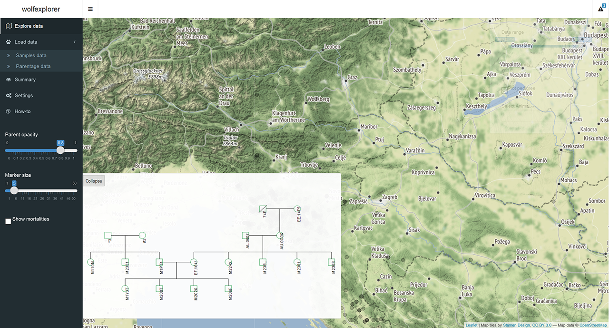
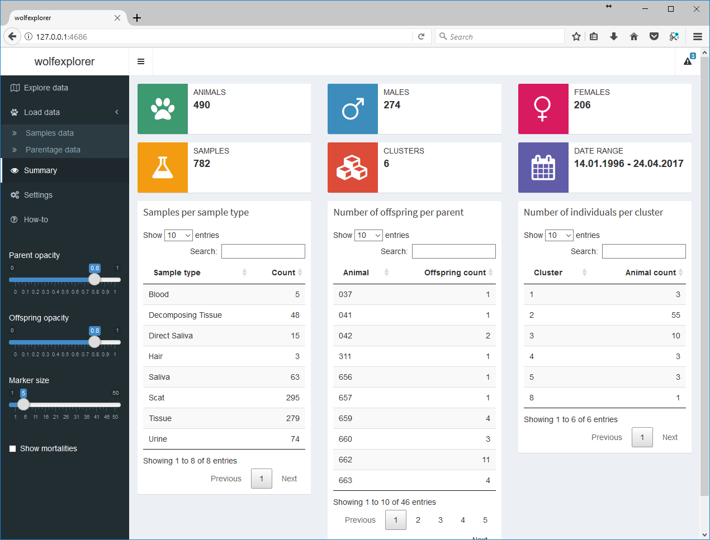

# wolfexplorer
Explorer designed to visualize complex multi-year multi-specimen data. Case study of (Slovenian) wolves.

### Limitations
This viewer will require you shape your data to a somewhat specific, yet general enough, format. It can display only certain coordinate systems. Luckily WGS (EPSG: 4326) is one of them. Data in the application is not persistent, but this limitation is something we're thinking of relaxing in the future.

WARNING: Date slider and some other features may not be working perfectly in some browsers (I'm looking at you, Chrome). If you experience problems, please do drop us a line and switch browsers. Testsing has been done on Firefox.

# How to run this application
## The easy way

Assuming you have all the packages installed*, starting with `shiny`, you can run this piece of code and you're off.
```r
shiny::runGitHub(repo = "wolfexplorer", username = "romunov")
```

`*` you can install packages listed in the [`app.R`](https://github.com/romunov/wolfexplorer/blob/master/app.R#L1) using something along the lines of

```
install.packages(c("shiny", "shinydashboard", "shinyjs", "leaflet", "RColorBrewer", "DT", "sp", "rgdal", "data.table", "ggplot2", "colourpicker", "tidyr", "plyr", "rgeos", "htmltools", "kinship2"))
```

## The manual way

First you need to clone the repository using git

```
git clone https://github.com/romunov/wolfexplorer
```

If you are using RStudio, open the project file, open `app.R` and press `Run App` button in the upper right corner of the script window.


If you are not using RStudio, just set working directory the project folder and run `runApp()`.

If all goes well, you should see the application, displayed either in RStudio viewer pane or in your default broweser (preferably).


# How to format data

To start, you should load the data using `Data > Samples data` menu for raw data and parentage information to `Data > Parentage data`.

### Samples data
Samples data should come in the following raw text format:

```r
 $ x          : int  630736 630736 630736 630736 630736 561700 561700 561700 618775 478450 ...
 $ y          : int  -158673 -158673 -158673 -158673 -158673 -67150 -67150 -67150 -136401 28000 ...
 $ date       : chr  "1996-01-14" "1996-01-14" "1996-01-14" "1996-01-14" ...
 $ sample_type: chr  "Decomposing Tissue" "Tissue" "Decomposing Tissue" "Tissue" ...
 $ animal     : int  79 80 81 109 110 99 105 144 82 83 ...
 $ sex        : chr  "" "M" "M" "F" ...
 $ sample_name: chr  "AP.07T2" "AP.07T4" "AP.07T6" "AP.07XM" ...
```

Notice the name of columns. In this example the coordinates for `x` and `y` are "Gauss Krüger" (EPSG: 3912). You should supply WGS (EPSG: 4326) coordinates for longitude and latitude, respectively, as they will be used without converting. See [GKtoWGS.R](https://github.com/romunov/wolfexplorer/blob/master/GKtoWGS.R) for implementation of conversion. This would also be the place to perhaps add your "parser" to accomodate your coordinate format.

`date` should come in the `%Y-%m-%d` form. `sample_type` right now is hard coded but this restriction will probably be relaxed in the near future. The rest should be pretty self explanatory. Animal is the designation for a group (or a singleton) of genotypes, `sex` and `sample_name` appear in the popup to aid in exploring of data.

### Parentage data (optional)
Data for parentage, derived from your favorite software, should be transformed to the following format:

```r
 $ offspring: int  658 661 662 663 668 689 701 717 718 724 ...
 $ mother   : int  41 689 42 656 42 812 684 698 684 689 ...
 $ father   : int  NA 667 828 666 828 37 NA NA NA 667 ...
 $ cluster  : int  2 3 2 2 2 3 2 5 2 3 ...
```
Column offspring is `animal` name (from samples data) of a putative child, `mother` and `father` its parents and `cluster` should be "family" id. This step is optional but note that some functionality will not be available (see below).

# Navigating the application
As mentioned above, you should read in the (genetic) samples data through the `Data > Samples data` menu. Imported data should appear in a table as seen in the picture below. Feel free to browse your data using autofilter input fields.


If you now head to `Explore data` menu, you should see the initial map with all samples plotted in grey. These markers are clickable. Go ahead, try it.
Upper right corner of the map should house a transparent box which now has a slider and an input field. Use the slider to filter out samples between specific dates. Note that this does not work for grey samples, but only on which animals you can select in the input field (and thus their displaying on the map).


If you also load parentage data (optional), you will be able to display selected animals' offspring as well.


Head back to the `Explore data` menu. Notice that another input field has appeared. In the below example you can see offspring of animal `659`. These should be colored orange if added to the selection.


It is also possible to plot pedigree tree. Once you've selected parentage data and selected a cluster ("family"), check `Plot pedigree` checkmark.


You can draw MCP (maximum convex polygon) for selected animals by checking the `Show MCP` checkmark. If there's only one sample, a circlular polygon is drawn around that point. For two points, a buffer of 1 km is drawn around the straight line connecting the two points. *These two cases are not true MCPs but is a compromise between accuracy of MCP and visual display of limited number of points.* For three points or more, a MCP as one would expect is created.


Sliders in the sidebar should aid in visualizing overlapping points/lines.

See menu `Summary` for information on the dataset. If you filter samples by date, summary will be calculated on that subset.



Legend colors can be manipulated through the `Settings` menu. Click on the input tab of the color and pick a color, any color.


